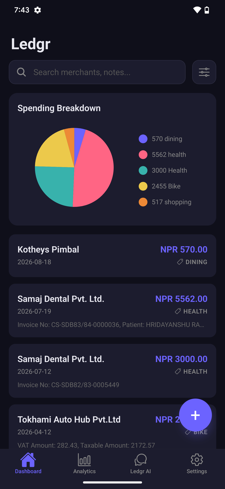
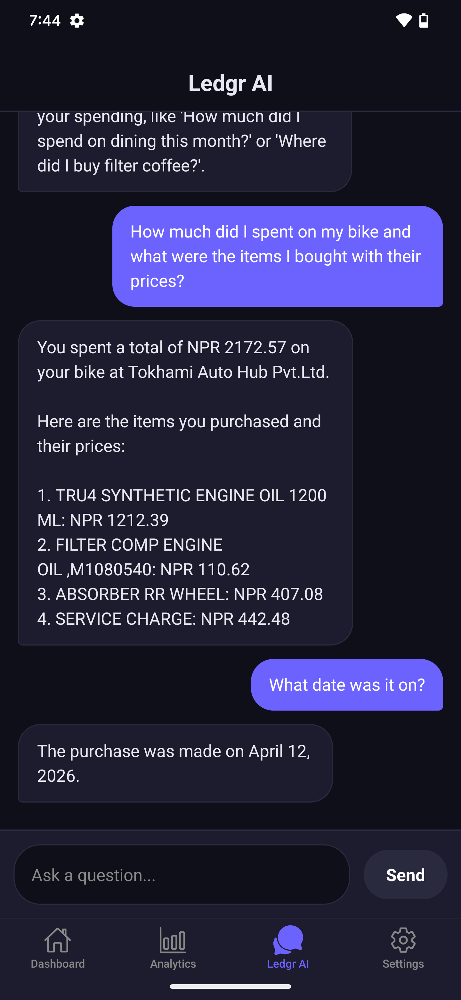
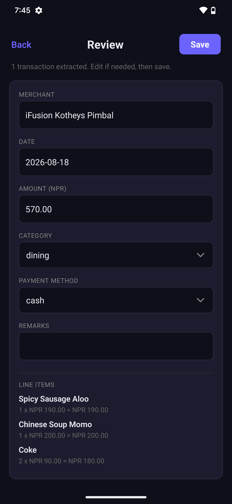
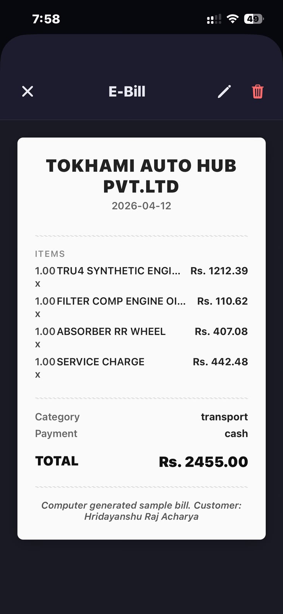
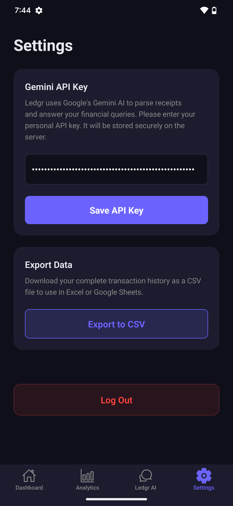

# Ledgr

> Intelligent Personal Finance Infrastructure

Ledgr is an automated personal finance platform that ingests unstructured financial documents—physical receipts, digital wallet screenshots, and PDF bank statements—and converts them into a structured, queryable data store using multimodal Language Models.

---

## Overview

Traditional finance tracking requires manual data entry. Ledgr eliminates this friction through automated multimodal extraction, persisting transaction data in both a relational database for deterministic queries and a vector store for semantic search.


*(Placeholder: Dashboard Overview)*

### Core Capabilities

*   **Multimodal Ingestion**: Process physical receipts, digital wallet screenshots (eSewa, Khalti, Fonepay), and bank statement PDFs.
*   **Structured Extraction**: Utilize Google Gemini Flash to extract merchant names, dates, amounts, categories, and line items.
*   **Interactive E-Bills**: View fully digitized, editable receipt breakdowns with itemized pricing.
*   **Budget Tracking**: Set weekly or monthly spending limits with visual progress bars and background push notifications when approaching thresholds.
*   **Dual Persistence Architecture**: 
    *   Relational (SQLite): Exact queries, dates, amounts, and categorical grouping.
    *   Vector Store (ChromaDB): Semantic similarity search for fuzzy queries.
*   **Agentic Routing**: Natural language queries are routed dynamically to a Text-to-SQL engine or a RAG pipeline based on intent analysis.


*(Placeholder: Natural Language Query Interface)*

---

## Architecture

```
Mobile Client (React Native + Expo)
        |
        |  multipart/form-data payload
        v
FastAPI Backend  ──── Google Gemini Flash (Multimodal LLM)
        |
        |  validated TransactionBatch (Pydantic v2)
        |
        +──── SQLite (SQLAlchemy)        <-- Quantitative routing
        |
        +──── ChromaDB (Vector Store)    <-- Semantic routing
        |
        v
LangChain Agent Router
        |
        +──── SQL Tool     -> "Calculate total spent on groceries in July"
        |
        +──── Vector Tool  -> "Where did I purchase filter coffee?"
```

### UI Previews

| Receipt Capture | Analytics Dashboard |
| :---: | :---: |
|  |  |
| **Capture & Extract** | **Data Visualization** |
| | |
| **Digital E-Bill** | **User Settings & Export** |
|  |  |

---

## Technology Stack

**Backend Infrastructure**
*   **Framework**: Python 3.11+, FastAPI, Uvicorn
*   **Validation**: Pydantic v2, pydantic-settings
*   **Database**: SQLAlchemy 2.0 (SQLite), ChromaDB
*   **AI Integration**: LangChain 0.3, langchain-google-genai

**Client Application**
*   **Framework**: React Native, Expo (Managed Workflow, TypeScript)
*   **Media Handling**: expo-camera, expo-image-picker, expo-document-picker
*   **Optimization**: expo-image-manipulator (Client-side compression)

**Deployment & Security**
*   **Hosting**: Oracle Cloud Always Free VM
*   **Authentication**: Multi-User SaaS (JWT Authentication, User-isolated Databases)
*   **API Security**: Bring-Your-Own-Key (BYOK) architecture for LLM integration
*   **CI/CD**: EAS Cloud Builds for native binaries

---

## System Requirements

*   Python 3.11 or higher
*   Node.js 18 or higher
*   Google AI Studio API Key

## Setup and Deployment

### Backend Initialization

```bash
cd backend
python -m venv .venv

# Activate virtual environment (Windows)
.venv\Scripts\activate
# Activate virtual environment (macOS/Linux)
# source .venv/bin/activate

pip install -r requirements.txt

cp .env.example .env
# Configure GOOGLE_API_KEY and authentication secrets in .env

python -m uvicorn app.main:app --reload
```
*API documentation is automatically generated at `http://127.0.0.1:8000/docs`*

### Client Initialization

```bash
cd client
npx expo install
npx expo start
```
*Use Expo Go on a physical device for development testing, or configure an Android Emulator/iOS Simulator.*

---

## Query Engine Capabilities

The `/api/v1/query/` endpoint processes natural language and determines the optimal query strategy:

| User Query | Selected Tool | Output |
|---|---|---|
| "Total spent on dining this month" | SQL Tool | Aggregated sum filtered by current month and category. |
| "How much did I spend via eSewa" | SQL Tool | Aggregated sum filtered by payment method. |
| "What did I buy at Bhatbhateni" | Vector Tool | Semantic retrieval of items associated with merchant. |
| "Where did I have soup momo" | Vector Tool | Fuzzy match of line items returning merchant locations. |
| "Average monthly grocery spending" | SQL Tool | Aggregated mathematical average over available months. |

---

## Project Status

**Status: Production Beta**
*   Backend core (Extraction, Dual-Storage, Agentic Router, Authentication) is stable.
*   Mobile client (Capture, Review, Query, Analytics) is functional and undergoing active development.
*   Production EAS Android builds are available. iOS binary generation is planned for a future release.
